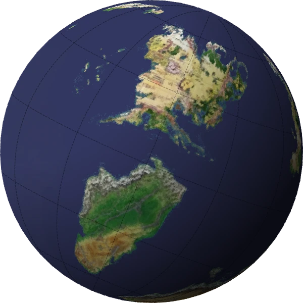

# Globe GIF Generator Pro

Globe GIF Generator Pro is a Python-based desktop utility that converts 2:1 equirectangular map images into beautiful, rotating 3D globe animations. Built with a responsive Tkinter GUI, it supports advanced cartographic rendering, including axial tilt, day/night directional lighting, and native WebP output.

## ✨ Features

* **Responsive Desktop GUI:** Built with Tkinter and fully multithreaded to ensure the UI remains responsive and provides live progress tracking during rendering.
* **Aspect Ratio Validation:** Automatically verifies input images and provides visual thumbnail previews to ensure your maps are ready for spherical projection.
* **Advanced Camera & Tilt Controls:** 
  * Adjust the **Camera Tilt** (latitude) to view the globe from above or below.
  * Adjust the **Axial/Ecliptic Tilt** (e.g., Earth's 23°) to dynamically roll the shadows across the equator.
* **3D Directional Lighting:** Optional volumetric shadow masking to give flat maps satisfying, realistic depth.
* **Cartographic Grids:** Toggleable latitude and longitude grid lines at customizable 15° or 30° intervals.
* **Modern Output Formats:** 
  * Export to classic **GIF** or modern, highly-compressed **WebP**.
  * Supports solid space-black backgrounds or smooth, anti-aliased **Transparent** backgrounds (WebP highly recommended for transparency).

## 🛠️ Prerequisites

* Python 3.8 or higher.
* A standard equirectangular map image (ideally exact 2:1 aspect ratio, e.g., 2048x1024).

## 🚀 Installation

It is highly recommended to run this tool inside a Python virtual environment to manage dependencies cleanly.

1. **Clone or Download the Repository:**
   ```bash
   git clone https://github.com/yourusername/globegif.git
   cd globegif
   ```

2. **Create and Activate a Virtual Environment:**
   * **Windows:**
     ```bash
     python -m venv .venv
     .venv\Scripts\activate
     ```
   * **Mac/Linux:**
     ```bash
     python3 -m venv .venv
     source .venv/bin/activate
     ```

3. **Install Dependencies:**
   The application relies on Matplotlib, Cartopy, Numpy, and Pillow. 
   ```bash
   pip install matplotlib cartopy numpy pillow
   ```
   *(Note: Cartopy requires underlying geometry libraries. If standard pip installation fails on your OS, you may need to install pre-compiled binaries via `conda install -c conda-forge cartopy` or download standard Windows wheels).*

## 🎮 Usage

1. Launch the application from your terminal:
   ```bash
   python globegif_v2.py
   ```
2. **Select Input Map:** Choose your 2:1 map image. 
3. **Configure Camera:** Set your degrees per frame (speed), FPS, and desired tilts.
4. **Choose Aesthetics:** Enable lighting, transparency, or grids to suit your project.
5. **Set Output:** Choose between GIF or WebP at the bottom of the aesthetics panel. (WebP provides significantly better quality and smaller file sizes, especially for transparent animations).
6. Click **Generate Rotating Globe** and watch the progress bar!

## ⚠️ Troubleshooting

* **The edges of my transparent GIF look crunchy/flicker.**
  GIFs only support 1-bit transparency (pixels are either 100% visible or invisible). For perfectly smooth anti-aliased edges on a transparent background, switch the output format to **WebP**.

## 📄 License

This project is open-source and available under the [MIT License](LICENSE).
